# sched

## Seguimiento con gdb del *context switch* mostrando registros y estado del stack
1) Antes de entrar a context_switch:
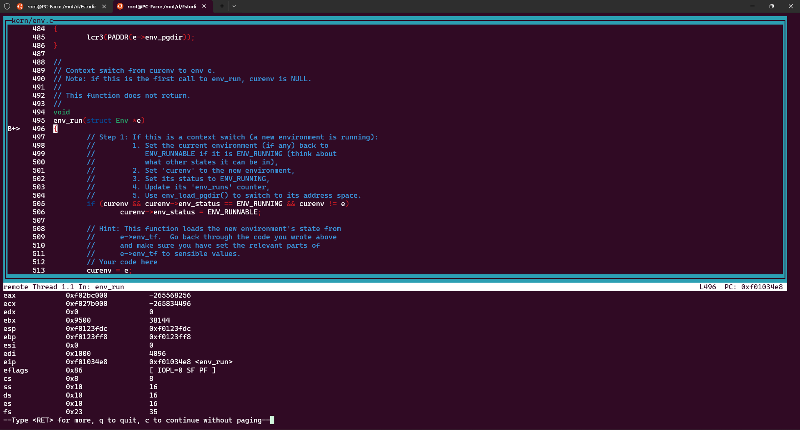
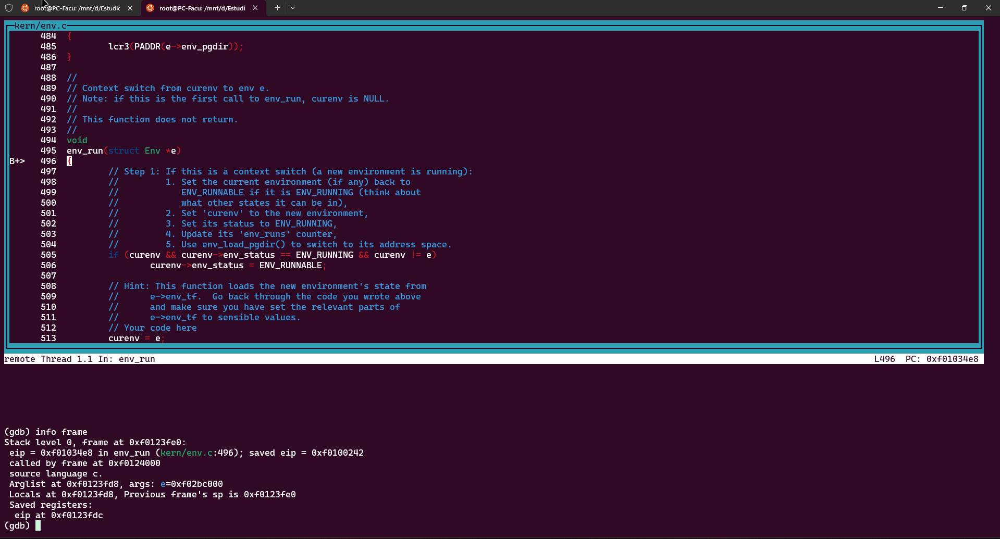
2) Al entrar a context_switch:
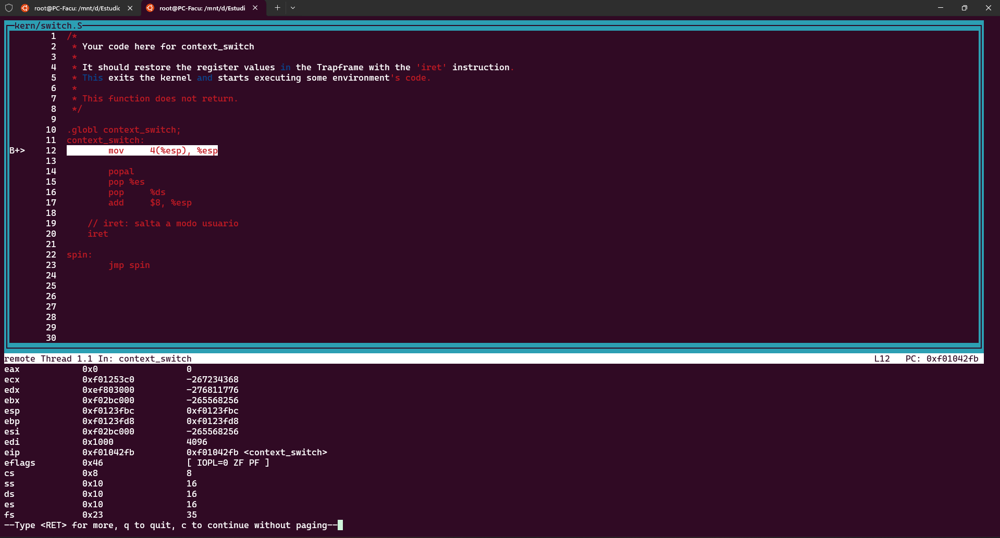
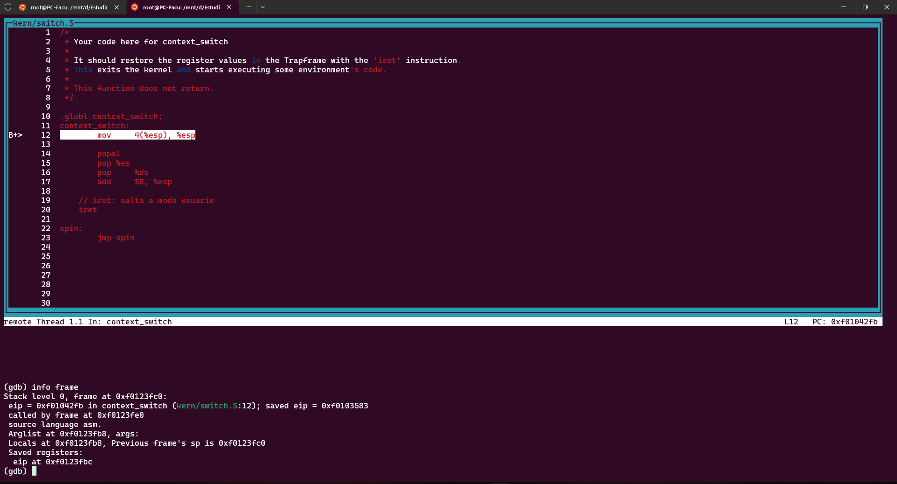
3) Instruccion a instruccion dentro de context_switch:
   1) ```mov 4(%esp),%esp```:
   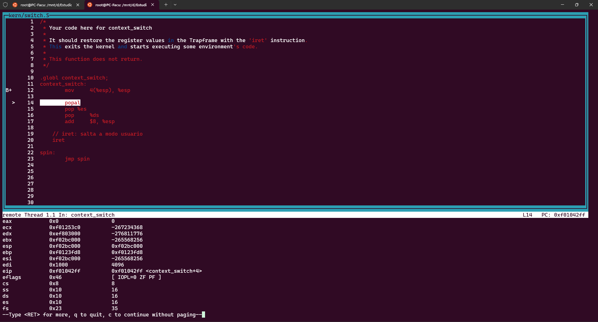
   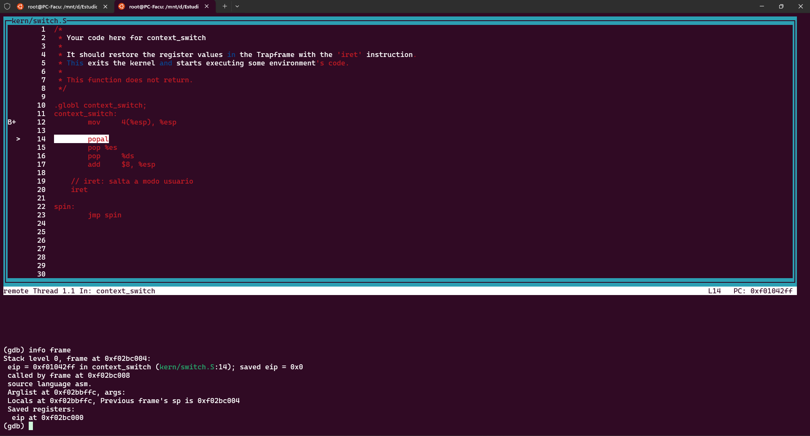
   2) ```popal```:
   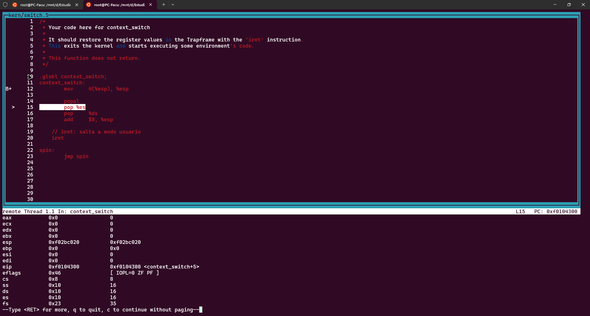
   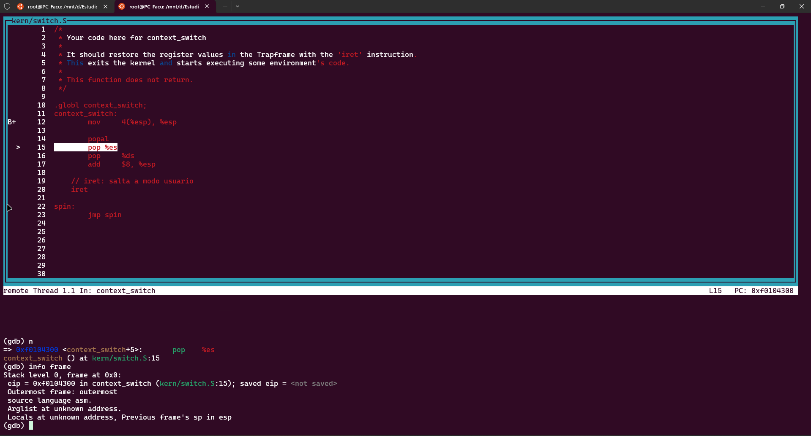
   3) ```pop %es```:
   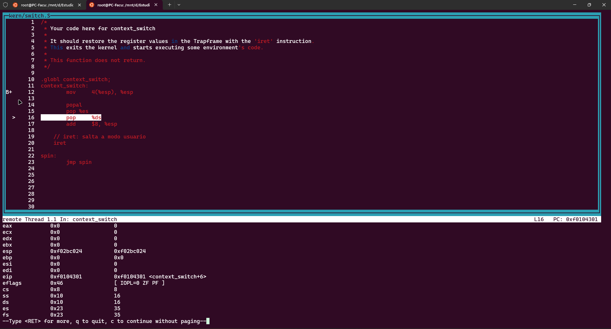
   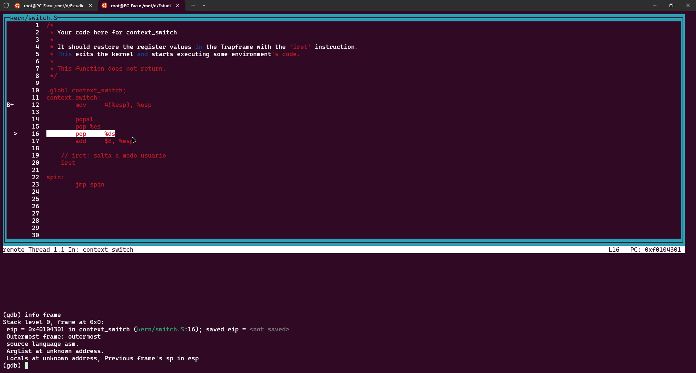
   4) ```pop %ds```:
   
   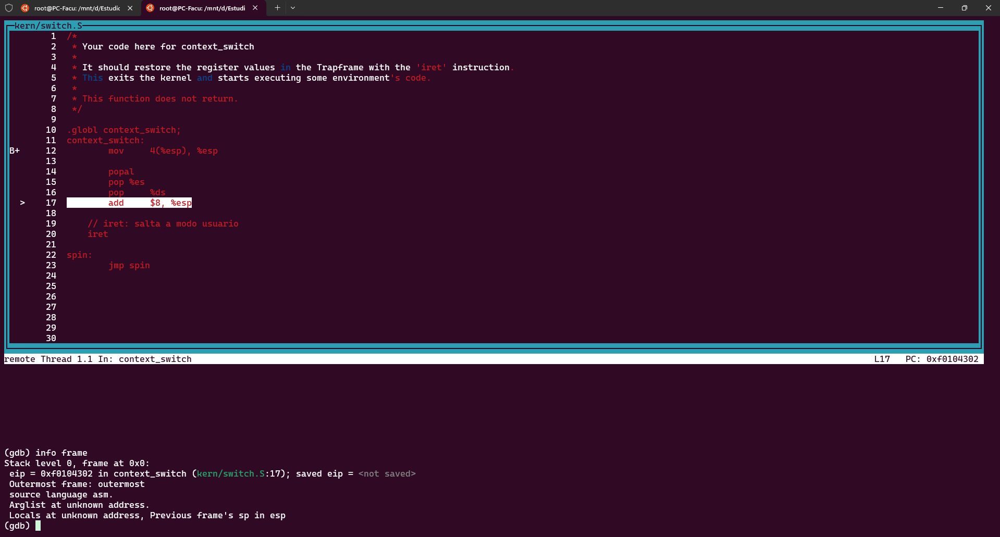
   5) ```add $8, %esp```:
   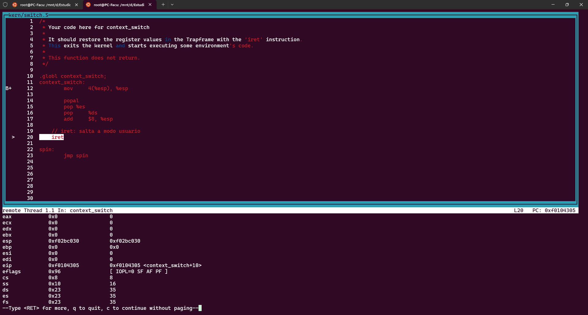
   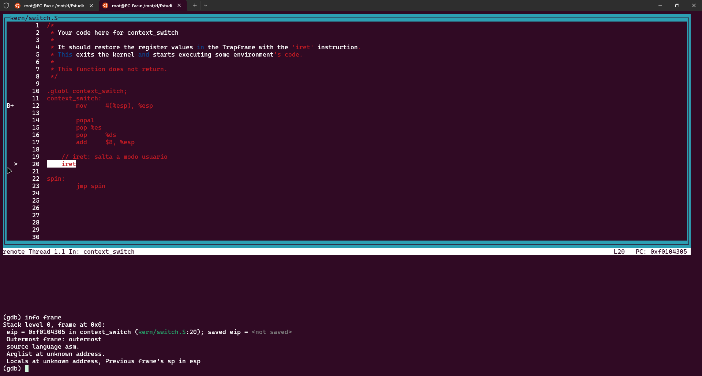
   6) ```iret```, asi quedan los registros y el stack al finalizar el context_switch:
   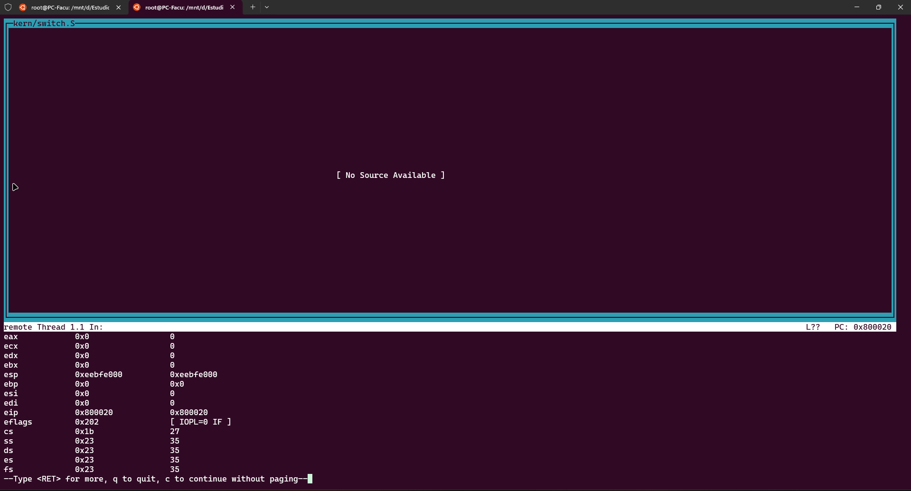
   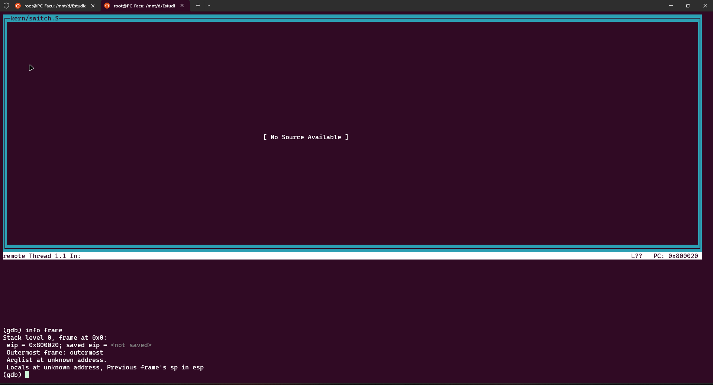


## Implementación de scheduler con prioridades
Nuestra implementación del scheduler se basa en una planificación por prioridades numéricas, donde los valores más bajos indican mayor prioridad. Para ello, definimos dos constantes: `PRIORIDAD_MIN = 1` (proceso más prioritario) y `PRIORIDAD_MAX = 10` (la peor prioridad).

El objetivo principal en cada invocación es elegir el proceso `ENV_RUNNABLE` con la menor prioridad bumérica, es decir el proceso más importante. Para lograrlo, se recorre de manera circular el arreglo `envs`, comenzando desde el índice siguiente al del proceso actualmente en ejecución, `curenv`. Durante la iteración, se compara la prioridad de cada proceso con la mejor prioridad encontrada hasta el momento (este valor se inicializa con un valor fuera de rango), y se actualiza el candidato si se encuentra una mejor prioridad. Esta rotación garantiza cierto grado de fairness permitiendo que todos los procesos tengan oportunidad de ser evaluados en cada ciclo.

Si no se encuentra ningún candidato en estado `RUNNABLE`, pero `curenv` sigue en estado `RUNNING` y está asignado al mismo CPU que ejecuta el scheduler, entonces se continúa su ejecución sin realizar un cambio de contexto.

En caso de que se haya elegido un proceso, se aplican dos políticas adicionales:

- **Reinicio de prioridades**:
Si el proceso elegido tiene la prioridad máxima (`PRIORIDAD_MAX`), se considera que ha alcanzado el máximo beneficio posible, y para evitar starvation, se reinician las prioridades de todos los procesos `RUNNABLE` al valor `PRIORIDAD_MIN`. Esto permite que otros procesos tengan oportunidad de ejecutarse.

- **Degradación por uso del CPU**:
Si el proceso elegido ya fue ejecutado previamente, se le incrementa en una unidad su `env_priority` (hasta un máximo de `PRIORIDAD_MAX`), degradando su prioridad. Este mecanismo evita el uso reiterado del CPU y promueve la rotación entre procesos.

Finalmente, se llama a `env_run(elegido)`. Si ningún proceso fue elegido y `curenv` no puede continuar, se llama a `sched_halt()`.

Este esquema garantiza que los procesos más prioritarios sean favorecidos,  mientras que los de menor urgencia sigan teniendo oportunidad de ejecutarse gracias a la combinación del reinicio de prioridades y la degradación progresiva por uso.

## Procesos de usuario creados

Para mostrar el correcto funcionamiento del scheduler con prioridades, creamos los siguientes ejemplos:

- Ejemplo con un único proceso (`prioridadunica`): Esta prueba crea un único proceso que modifica su prioridad mediante la syscall `sys_modificar_prioridad`. El proceso se ejecuta varias veces y se verifica que su prioridad aumente correctamente después de cada iteración, mostrando que el scheduler actualiza la prioridad con un solo proceso.

- Ejemplo con varios procesos usando fork (`prioridadesfork`): Esta prueba crea una cadena de procesos mediante `fork()` y permite observar cómo el scheduler maneja múltiples procesos con diferentes prioridades, alternando la ejecución según la prioridad actual de cada proceso.

Para probar la ejecución de estos nuevos procesos se pueden correr los comandos `make run-prioridadunica-nox USE_PR=1` y `make run-prioridadesfork-nox USE_PR=1` para correr cada uno por separado.